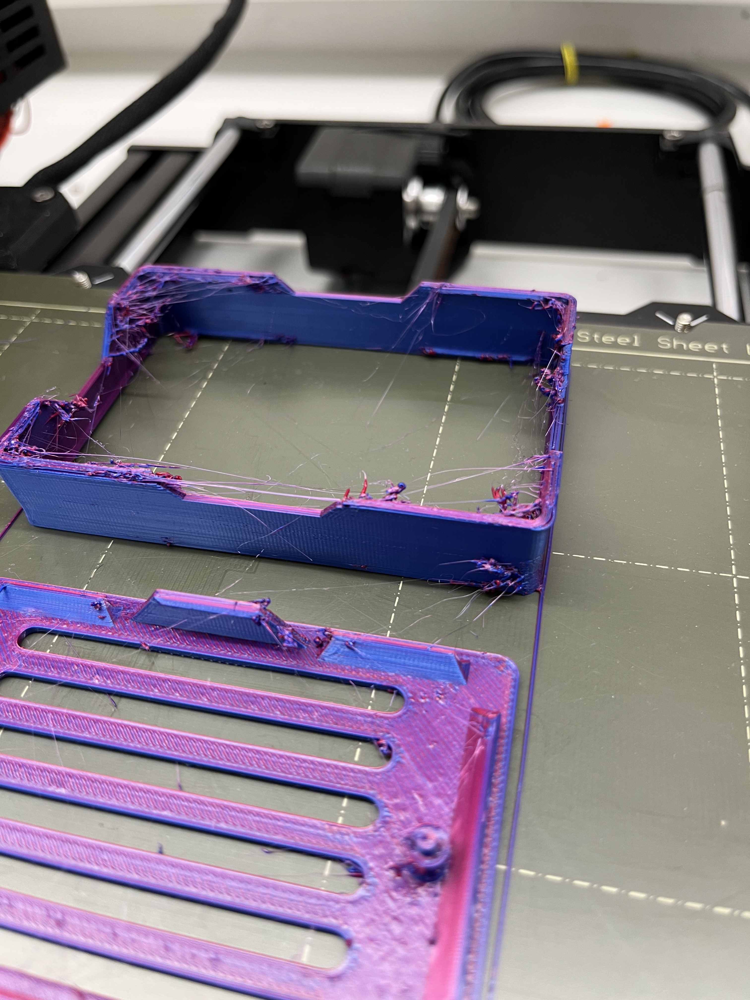

# featherTuner

## What it does

It tells the frequency/pitch of a guitar string.

## How it's done

With a piezo sensor, the guitar headstock's vibrations are converted into a voltage, which the Arduino (a Feather ESP32 S2 Reverse TFT) processes using Fast Fourier Transform to provide the output frequency in Hz.

## Difficulties I encountered
 - Understanding and Applying the FFT algorithm and library.
 - Choosing the right Windowing method to avoid misreadings

## Images
failed print

### TODO
 - add finished product image
 - perform FFT with button press instead of in intervals
 - Display Battery Percentage 

